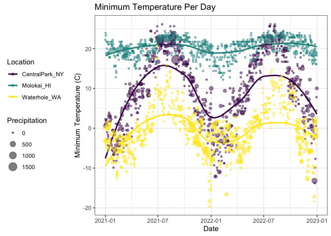
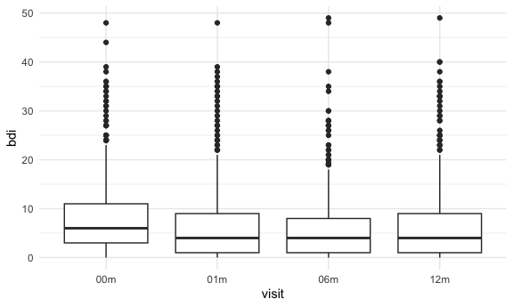

01OCT24_viz_and_eda_2
================
Stella Koo
2024-10-01

## Vizualizations_Part2

``` r
library(tidyverse)

weather_df = 
  rnoaa::meteo_pull_monitors(
    c("USW00094728", "USW00022534", "USS0023B17S"),
    var = c("PRCP", "TMIN", "TMAX"), 
    date_min = "2021-01-01",
    date_max = "2022-12-31") |>
  mutate(
    name = case_match(
      id, 
      "USW00094728" ~ "CentralPark_NY", 
      "USW00022534" ~ "Molokai_HI",
      "USS0023B17S" ~ "Waterhole_WA"),
    tmin = tmin / 10,
    tmax = tmax / 10) |>
  select(name, id, everything())

weather_df
```

    ## # A tibble: 2,190 × 6
    ##    name           id          date        prcp  tmax  tmin
    ##    <chr>          <chr>       <date>     <dbl> <dbl> <dbl>
    ##  1 CentralPark_NY USW00094728 2021-01-01   157   4.4   0.6
    ##  2 CentralPark_NY USW00094728 2021-01-02    13  10.6   2.2
    ##  3 CentralPark_NY USW00094728 2021-01-03    56   3.3   1.1
    ##  4 CentralPark_NY USW00094728 2021-01-04     5   6.1   1.7
    ##  5 CentralPark_NY USW00094728 2021-01-05     0   5.6   2.2
    ##  6 CentralPark_NY USW00094728 2021-01-06     0   5     1.1
    ##  7 CentralPark_NY USW00094728 2021-01-07     0   5    -1  
    ##  8 CentralPark_NY USW00094728 2021-01-08     0   2.8  -2.7
    ##  9 CentralPark_NY USW00094728 2021-01-09     0   2.8  -4.3
    ## 10 CentralPark_NY USW00094728 2021-01-10     0   5    -1.6
    ## # ℹ 2,180 more rows

### Labels

`labs()` to provide informative axis, plot titles, captions, etc.

- In the following example, `color = "Location"` sets title for the
  legend that describes color aesthetic.

``` r
weather_labels = weather_df |>
  ggplot(aes(x = tmin, y = tmax)) +
  geom_point(aes(color = name), alpha = 0.5) +
  labs(title = "Temperature plot",
    x = "Minimum daily temperature (C)",
    y = "Maxiumum daily temperature (C)",
    color = "Location",
    caption = "Data from the rnoaa package") 

weather_labels
```

<!-- -->

### Scales

`scale_x_*` and `scale_y_*`: control over the location and specification
of tick marks on the X or Y axis. (where \* depends on the type of
variable mapped to `x` and `y` -\> discrete or continuous)

- `breaks` defines where the tick marks should appear on the axis.
- `labels` defines the text displayed at each tick mark.

``` r
weather_scales = weather_labels +
  scale_x_continuous(
    breaks = c(-15, 0, 15),
    labels = c("-15º C", "0", "15"))

weather_scales
```

<!-- -->

There are variety of options to use. Need to google to check how to do
what I want.

- `limits`: sets the range of values that will be displayed on the
  x-axis.
- `trans`: transforms the y-axis using the assigned transformation.
- `position`: moves the y-axis to the assigned side of the plot.

``` r
weather_labels + 
  scale_x_continuous(
    breaks = c(-15, 0, 15), 
    labels = c("-15ºC", "0", "15"),
    limits = c(-20, 30)) + 
  scale_y_continuous(
    trans = "sqrt", 
    position = "right")
```

<!-- -->

There are several ways to produce the desired result:

- `scale_y_sqrt()` added to `ggplot` to transform y-scale.
- `xlim()` controls the plot limits in the X axis.
- `scale_color_hue()` controls the color scale and the name in the plot
  lengend.
  - `scale_color_hue(h = c(100, 300))`: If you have 3 levels (aka
    categories), for example, it will divide the hue range into 3
    distinct colors spaced between 100 and 300. In this case, from green
    to purple.

``` r
weather_labels + 
  scale_color_hue(h = c(100, 300))
```

<!-- -->

`scale_color_viridis()` from `viridis` package is used to apply a
viridis color palette to the plot without having to choose my own.

- `name` sets the title of lengend to “Location”
- `discrete = TRUE`: tells ggplot2 to use the Viridis color palette for
  a discrete variable. When set to TRUE, distinct colors are assigned to
  each level of the categorical variable.

``` r
ggp_temp_plot = 
  weather_labels + 
  viridis::scale_color_viridis(
    name = "Location", 
    discrete = TRUE)

ggp_temp_plot
```

<!-- -->

In cases data is not discrete, use `viridis::scale_fill_viridis()`
function for the fill aesthetic used in histograms, density plots, etc.

## Themes

Used to modify non-data elements of a plot. Control things like
background color and location of the the legend. Help with the overall
appearance of the plot.

- `legend.position` changes location of the legend.
  - `legend.position = "none"` will remove the legend.
- `theme_gray()`: default theme in `ggplot2`. It features a light gray
  background with white grid lines.
- `theme_bw()`: a white background and black grid lines.
- `theme_classic()`: classic look for plots.

The ordering of `theme_bw()` and `theme()` matters – `theme()` changes a
particular element of the plot’s current “theme”. If you call `theme()`
to change the some element and then `theme_bw()`, the changes introduced
by `theme()` are overwritten by `theme_bw()`.

``` r
ggp_temp_plot + 
  theme_bw() + 
  theme(legend.position = "bottom")
```

<!-- -->

#### Learning Assessment

``` r
weather_df |>
  ggplot(aes(x = date, y = tmin, color = name)) +
  geom_smooth(se = FALSE) +
  geom_point(aes(size = prcp), alpha = 0.5) +
  labs(title = "Minimum Temperature Per Day",
       x = "Date",
       y = "Minimum Temperature (C)",
       color = "Location",
       size = "Precipitation") +
  viridis::scale_color_viridis(discrete = TRUE) +
  theme_bw() +
  theme(legend.position = "left")
```

    ## `geom_smooth()` using method = 'loess' and formula = 'y ~ x'

<!-- -->

### Setting Options

The following code chunk is normally added in the beginning of new file
to set figure preferences as global options.

``` r
knitr::opts_chunk$set(
  fig.width = 6,
  fig.asp = .6,
  out.width = "90%"
)

theme_set(theme_minimal() + theme(legend.position = "bottom"))

options(
  ggplot2.continuous.color = "viridis",
  ggplot2.continuous.fill = "viridis"
)

scale_colour_discrete = scale_colour_viridis_d
scale_fill_discrete = scale_fill_viridis_d
```

### Data argument in `geom_*`

Can split `weather_df` into separate datasets for Central Park and
Molokai by using one in the ggplot() call and another in geom_line():

``` r
central_park_df =
  weather_df |>
  filter(name == "CentralPark_NY")

molokai_df = 
  weather_df |>
  filter(name == "Molokai_HI")

ggplot(data = molokai_df, aes(x = date, y = tmax, color = name)) +
  geom_point() +
  geom_line(data = central_park_df)
```


### `patchwork` package

Used to show two or three fundamentally different plots in the same
graphic.

``` r
library(patchwork)

tmax_tmin_p = 
  weather_df |> 
  ggplot(aes(x = tmax, y = tmin, color = name)) + 
  geom_point(alpha = .5) +
  theme(legend.position = "none")

prcp_dens_p = 
  weather_df |> 
  filter(prcp > 0) |> 
  ggplot(aes(x = prcp, fill = name)) + 
  geom_density(alpha = .5) + 
  theme(legend.position = "none")

tmax_date_p = 
  weather_df |> 
  ggplot(aes(x = date, y = tmax, color = name)) + 
  geom_point(alpha = .5) +
  geom_smooth(se = FALSE) + 
  theme(legend.position = "bottom")

(tmax_tmin_p + prcp_dens_p) / tmax_date_p
```

    ## `geom_smooth()` using method = 'loess' and formula = 'y ~ x'


### Data Manipulation

- `forcats::fct_relevel`: Reorders the levels of a factor to a specific
  order that you define.
- `forcats::fct_reorder`: Reorders the levels of a factor based on the
  values of another variable.

``` r
weather_df |>
  mutate(name = forcats::fct_relevel(name, c("Molokai_HI", "CentralPark_NY", "Waterhole_WA"))) |> 
  ggplot(aes(x = name, y = tmax)) + 
  geom_violin(aes(fill = name), color = "blue", alpha = .5) + 
  theme(legend.position = "bottom")
```


``` r
weather_df |>
  mutate(name = forcats::fct_reorder(name, tmax)) |> 
  ggplot(aes(x = name, y = tmax)) + 
  geom_violin(aes(fill = name), color = "blue", alpha = .5) + 
  theme(legend.position = "bottom")
```


It is easier to manipulate the data first and then create the desired
plots than finding ways within the plot code:

- Manipulate data to facet panels across the `name` variable, and create
  separate densities for `tmax` and `tmin` in each panel.

``` r
weather_df |>
  select(name, tmax, tmin) |> 
  pivot_longer(
    tmax:tmin,
    names_to = "observation", 
    values_to = "temp") |> 
  ggplot(aes(x = temp, fill = observation)) +
  geom_density(alpha = .5) + 
  facet_grid(~name)
```


#### Examples

``` r
pulse_data = 
  haven::read_sas("./data/public_pulse_data.sas7bdat") |>
  janitor::clean_names() |>
  pivot_longer(
    bdi_score_bl:bdi_score_12m,
    names_to = "visit", 
    names_prefix = "bdi_score_",
    values_to = "bdi") |>
  select(id, visit, everything()) |>
  mutate(
    visit = recode(visit, "bl" = "00m"),
    visit = factor(visit, levels = str_c(c("00", "01", "06", "12"), "m"))) |>
  arrange(id, visit)

ggplot(pulse_data, aes(x = visit, y = bdi)) + 
  geom_boxplot()
```



``` r
pup_data = 
  read_csv("./data/FAS_pups.csv", na = c("NA", ".", "")) |>
  janitor::clean_names() |>
  mutate(
    sex = 
      case_match(
        sex, 
        1 ~ "male", 
        2 ~ "female"))

litter_data = 
  read_csv("./data/FAS_litters.csv", na = c("NA", ".", "")) |>
  janitor::clean_names() |>
  separate(group, into = c("dose", "day_of_tx"), sep = 3)

fas_data = left_join(pup_data, litter_data, by = "litter_number") 

fas_data |> 
  select(sex, dose, day_of_tx, pd_ears:pd_walk) |> 
  pivot_longer(
    pd_ears:pd_walk,
    names_to = "outcome", 
    values_to = "pn_day") |> 
  drop_na() |> 
  mutate(outcome = forcats::fct_reorder(outcome, pn_day, median)) |> 
  ggplot(aes(x = dose, y = pn_day)) + 
  geom_violin() + 
  facet_grid(day_of_tx ~ outcome) # rows ~ columns of the grid
```


