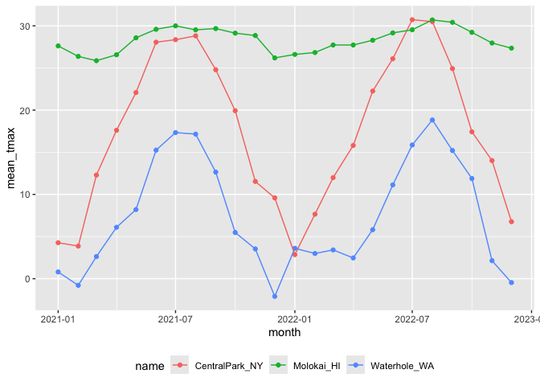

03OCT24_EDA
================
Stella Koo
2024-10-03

## Explatory Data Analysis (EDA)

Analyze and investigate data sets and summarize their main
characteristics, often employing data visualization methods. Discover
patterns, spot anomalies, test a hypothesis, or check assumptions.

- Conduct EDA using `dplyr` verbs (`group_by` and `summarize`)

`rnoaa::meteo_pull_monitors()` pulls weather data from National Oceanic
and Atmospheric Administration database (NOAA) for a list of weather
stations.

``` r
library(tidyverse)

weather_df = 
  rnoaa::meteo_pull_monitors(
    c("USW00094728", "USW00022534", "USS0023B17S"),
    var = c("PRCP", "TMIN", "TMAX"), 
    date_min = "2021-01-01",
    date_max = "2022-12-31") |>
  mutate(
    name = case_match(
      id, 
      "USW00094728" ~ "CentralPark_NY", 
      "USW00022534" ~ "Molokai_HI",
      "USS0023B17S" ~ "Waterhole_WA"),
    tmin = tmin / 10,
    tmax = tmax / 10,
    month = lubridate::floor_date(date, unit = "month")) |>
  select(name, id, everything())
```

### Initial Numeric Explorations

``` r
weather_df |> 
  ggplot(aes(x = prcp)) + 
  geom_histogram()
```

    ## `stat_bin()` using `bins = 30`. Pick better value with `binwidth`.

<!-- -->

Very skewed distribution. Majority of days have no precipitation.
Examining the relatively few days have very high precipitation might be
helpful.

``` r
weather_df |> 
  filter(prcp >= 1000)
```

    ## # A tibble: 3 × 7
    ##   name           id          date        prcp  tmax  tmin month     
    ##   <chr>          <chr>       <date>     <dbl> <dbl> <dbl> <date>    
    ## 1 CentralPark_NY USW00094728 2021-08-21  1130  27.8  22.8 2021-08-01
    ## 2 CentralPark_NY USW00094728 2021-09-01  1811  25.6  17.2 2021-09-01
    ## 3 Molokai_HI     USW00022534 2022-12-18  1120  23.3  18.9 2022-12-01

``` r
weather_df |> 
  filter(tmax >= 20, tmax <= 30) |> 
  ggplot(aes(x = tmin, y = tmax, color = name, shape = name)) + 
  geom_point(alpha = .75)
```

<!-- -->

The previous scatterplot shows that Central Park and Molokai report
temperature values differently from Waterhole.

### `group_by`

Only using `group_by()` without a function like `summarize()`,
`mutate()`, or `filter()`, it won’t change or reduce the data. The data
will be grouped internally, but all the rows will still be displayed.

- `ungroup()` will remove groups.

``` r
weather_df |>
  group_by(name, month)
```

    ## # A tibble: 2,190 × 7
    ## # Groups:   name, month [72]
    ##    name           id          date        prcp  tmax  tmin month     
    ##    <chr>          <chr>       <date>     <dbl> <dbl> <dbl> <date>    
    ##  1 CentralPark_NY USW00094728 2021-01-01   157   4.4   0.6 2021-01-01
    ##  2 CentralPark_NY USW00094728 2021-01-02    13  10.6   2.2 2021-01-01
    ##  3 CentralPark_NY USW00094728 2021-01-03    56   3.3   1.1 2021-01-01
    ##  4 CentralPark_NY USW00094728 2021-01-04     5   6.1   1.7 2021-01-01
    ##  5 CentralPark_NY USW00094728 2021-01-05     0   5.6   2.2 2021-01-01
    ##  6 CentralPark_NY USW00094728 2021-01-06     0   5     1.1 2021-01-01
    ##  7 CentralPark_NY USW00094728 2021-01-07     0   5    -1   2021-01-01
    ##  8 CentralPark_NY USW00094728 2021-01-08     0   2.8  -2.7 2021-01-01
    ##  9 CentralPark_NY USW00094728 2021-01-09     0   2.8  -4.3 2021-01-01
    ## 10 CentralPark_NY USW00094728 2021-01-10     0   5    -1.6 2021-01-01
    ## # ℹ 2,180 more rows

### Counting things

#### `group_by()` and `summarize()`

Counting number of observations in each location in the complete
dataset:

``` r
weather_df |>
  group_by(name) |>
  summarize(n_obs = n())
```

    ## # A tibble: 3 × 2
    ##   name           n_obs
    ##   <chr>          <int>
    ## 1 CentralPark_NY   730
    ## 2 Molokai_HI       730
    ## 3 Waterhole_WA     730

Can group by more than one variable (e.g each location and month):

- `n()` counts number of rows.

``` r
weather_df |>
  group_by(name, month) |>
  summarize(n_obs = n()) 
```

    ## `summarise()` has grouped output by 'name'. You can override using the
    ## `.groups` argument.

    ## # A tibble: 72 × 3
    ## # Groups:   name [3]
    ##    name           month      n_obs
    ##    <chr>          <date>     <int>
    ##  1 CentralPark_NY 2021-01-01    31
    ##  2 CentralPark_NY 2021-02-01    28
    ##  3 CentralPark_NY 2021-03-01    31
    ##  4 CentralPark_NY 2021-04-01    30
    ##  5 CentralPark_NY 2021-05-01    31
    ##  6 CentralPark_NY 2021-06-01    30
    ##  7 CentralPark_NY 2021-07-01    31
    ##  8 CentralPark_NY 2021-08-01    31
    ##  9 CentralPark_NY 2021-09-01    30
    ## 10 CentralPark_NY 2021-10-01    31
    ## # ℹ 62 more rows

Can compute multiple summaries within each group:

``` r
weather_df |>
  group_by(month) |>
  summarize(
    n_obs = n(),
    n_days = n_distinct(date))
```

    ## # A tibble: 24 × 3
    ##    month      n_obs n_days
    ##    <date>     <int>  <int>
    ##  1 2021-01-01    93     31
    ##  2 2021-02-01    84     28
    ##  3 2021-03-01    93     31
    ##  4 2021-04-01    90     30
    ##  5 2021-05-01    93     31
    ##  6 2021-06-01    90     30
    ##  7 2021-07-01    93     31
    ##  8 2021-08-01    93     31
    ##  9 2021-09-01    90     30
    ## 10 2021-10-01    93     31
    ## # ℹ 14 more rows

To tabulate the frequency of a binary outcome across levels of a binary
predictor:

- E.g. Number of cold and not-cold days in Central Park and Waterhole.

``` r
weather_df |> 
  drop_na(tmax) |> 
  mutate(
    cold = case_when(
      tmax <  5 ~ "cold",
      tmax >= 5 ~ "not_cold",
      TRUE      ~ ""
  )) |> 
  filter(name != "Molokai_HI") |> 
  group_by(name, cold) |> 
  summarize(count = n())
```

    ## `summarise()` has grouped output by 'name'. You can override using the
    ## `.groups` argument.

    ## # A tibble: 4 × 3
    ## # Groups:   name [2]
    ##   name           cold     count
    ##   <chr>          <chr>    <int>
    ## 1 CentralPark_NY cold        96
    ## 2 CentralPark_NY not_cold   634
    ## 3 Waterhole_WA   cold       319
    ## 4 Waterhole_WA   not_cold   395

Can also re-organize into a more standard (non-tidy) 2x2 table using
`pivot_wider` or `janitor::tabyl`:

``` r
weather_df |> 
  drop_na(tmax) |> 
  mutate(cold = case_when(
    tmax <  5 ~ "cold",
    tmax >= 5 ~ "not_cold",
    TRUE     ~ ""
  )) |> 
  filter(name != "Molokai_HI") |> 
  janitor::tabyl(name, cold)
```

    ##            name cold not_cold
    ##  CentralPark_NY   96      634
    ##    Waterhole_WA  319      395

#### `count()`

Can also use `count()` instead of `group_by()` and `summarize()`:

- Creates a dataframe that can be manipulated directly.

``` r
weather_df |>
  count(month, name)
```

    ## # A tibble: 72 × 3
    ##    month      name               n
    ##    <date>     <chr>          <int>
    ##  1 2021-01-01 CentralPark_NY    31
    ##  2 2021-01-01 Molokai_HI        31
    ##  3 2021-01-01 Waterhole_WA      31
    ##  4 2021-02-01 CentralPark_NY    28
    ##  5 2021-02-01 Molokai_HI        28
    ##  6 2021-02-01 Waterhole_WA      28
    ##  7 2021-03-01 CentralPark_NY    31
    ##  8 2021-03-01 Molokai_HI        31
    ##  9 2021-03-01 Waterhole_WA      31
    ## 10 2021-04-01 CentralPark_NY    30
    ## # ℹ 62 more rows

``` r
weather_df |>
  count(month, name = "n_obs")
```

    ## # A tibble: 24 × 2
    ##    month      n_obs
    ##    <date>     <int>
    ##  1 2021-01-01    93
    ##  2 2021-02-01    84
    ##  3 2021-03-01    93
    ##  4 2021-04-01    90
    ##  5 2021-05-01    93
    ##  6 2021-06-01    90
    ##  7 2021-07-01    93
    ##  8 2021-08-01    93
    ##  9 2021-09-01    90
    ## 10 2021-10-01    93
    ## # ℹ 14 more rows

#### `table()` function

Base R’s `table` function also produces summaries. table\`’s output is
of class table and is hard to do any additional work with.

``` r
weather_df |>
  pull(month) |>
  table()
```

    ## 
    ## 2021-01-01 2021-02-01 2021-03-01 2021-04-01 2021-05-01 2021-06-01 2021-07-01 
    ##         93         84         93         90         93         90         93 
    ## 2021-08-01 2021-09-01 2021-10-01 2021-11-01 2021-12-01 2022-01-01 2022-02-01 
    ##         93         90         93         90         93         93         84 
    ## 2022-03-01 2022-04-01 2022-05-01 2022-06-01 2022-07-01 2022-08-01 2022-09-01 
    ##         93         90         93         90         93         93         90 
    ## 2022-10-01 2022-11-01 2022-12-01 
    ##         93         90         93

### General Summaries

Standard statistical summaries are regularly computed in `summarize()`
using functions like `mean()`, `median()`, `var()`, `sd()`, `mad()`,
`IQR()`, `min()`, and `max()`. To use these, indicate the variable to
which they apply and include any additional arguments as necessary.

``` r
weather_df |>
  group_by(month) |>
  summarize(
    mean_tmax = mean(tmax, na.rm = TRUE),
    mean_prec = mean(prcp, na.rm = TRUE),
    median_tmax = median(tmax),
    sd_tmax = sd(tmax))
```

    ## # A tibble: 24 × 5
    ##    month      mean_tmax mean_prec median_tmax sd_tmax
    ##    <date>         <dbl>     <dbl>       <dbl>   <dbl>
    ##  1 2021-01-01     10.9       39.5         5     12.2 
    ##  2 2021-02-01      9.82      42.6         2.8   12.2 
    ##  3 2021-03-01     13.7       55.5        NA     NA   
    ##  4 2021-04-01     16.8       14.7        18.0    9.29
    ##  5 2021-05-01     19.6       17.3        22.2    9.40
    ##  6 2021-06-01     24.3       14.1        28.3    8.28
    ##  7 2021-07-01     25.2       30.7        28.3    6.19
    ##  8 2021-08-01     25.2       30.6        28.3    6.72
    ##  9 2021-09-01     22.4       35.4        24.4    7.69
    ## 10 2021-10-01     18.2       36.0        20.6   10.1 
    ## # ℹ 14 more rows

If want to summarize multiple columns using the same summary, the
`across` function is helpful:

``` r
weather_df |>
  group_by(name, month) |>
  summarize(across(tmin:prcp, mean))
```

    ## `summarise()` has grouped output by 'name'. You can override using the
    ## `.groups` argument.

    ## # A tibble: 72 × 5
    ## # Groups:   name [3]
    ##    name           month       tmin  tmax  prcp
    ##    <chr>          <date>     <dbl> <dbl> <dbl>
    ##  1 CentralPark_NY 2021-01-01 -1.15  4.27  18.9
    ##  2 CentralPark_NY 2021-02-01 -1.39  3.87  46.6
    ##  3 CentralPark_NY 2021-03-01  3.1  12.3   28.0
    ##  4 CentralPark_NY 2021-04-01  7.48 17.6   22.8
    ##  5 CentralPark_NY 2021-05-01 12.2  22.1   35.7
    ##  6 CentralPark_NY 2021-06-01 18.9  28.1   22.2
    ##  7 CentralPark_NY 2021-07-01 20.6  28.4   90.9
    ##  8 CentralPark_NY 2021-08-01 21.8  28.8   84.5
    ##  9 CentralPark_NY 2021-09-01 17.8  24.8   84.9
    ## 10 CentralPark_NY 2021-10-01 13.4  19.9   43.1
    ## # ℹ 62 more rows

Can also incorporate grouping and summarizing within broader analysis
pipelines. E.g. can create a plot based on monthly summary:

``` r
weather_df |>
  group_by(name, month) |>
  summarize(mean_tmax = mean(tmax, na.rm = TRUE)) |>
  ggplot(aes(x = month, y= mean_tmax, color = name)) +
  geom_point() + geom_line() +
  theme(legend.position = "bottom")
```

    ## `summarise()` has grouped output by 'name'. You can override using the
    ## `.groups` argument.

<!-- -->

`knitr::kable()` function creates a more human-readable table for
reporting.

- The `digits` argument controls number of decimal places displayed for
  numeric values.

``` r
weather_df |>
  group_by(name, month) |>
  summarize(mean_tmax = mean(tmax, na.rm = TRUE)) |> 
  pivot_wider(
    names_from = name,
    values_from = mean_tmax) |> 
  knitr::kable(digits = 1)
```

    ## `summarise()` has grouped output by 'name'. You can override using the
    ## `.groups` argument.

| month      | CentralPark_NY | Molokai_HI | Waterhole_WA |
|:-----------|---------------:|-----------:|-------------:|
| 2021-01-01 |            4.3 |       27.6 |          0.8 |
| 2021-02-01 |            3.9 |       26.4 |         -0.8 |
| 2021-03-01 |           12.3 |       25.9 |          2.6 |
| 2021-04-01 |           17.6 |       26.6 |          6.1 |
| 2021-05-01 |           22.1 |       28.6 |          8.2 |
| 2021-06-01 |           28.1 |       29.6 |         15.3 |
| 2021-07-01 |           28.4 |       30.0 |         17.3 |
| 2021-08-01 |           28.8 |       29.5 |         17.2 |
| 2021-09-01 |           24.8 |       29.7 |         12.6 |
| 2021-10-01 |           19.9 |       29.1 |          5.5 |
| 2021-11-01 |           11.5 |       28.8 |          3.5 |
| 2021-12-01 |            9.6 |       26.2 |         -2.1 |
| 2022-01-01 |            2.9 |       26.6 |          3.6 |
| 2022-02-01 |            7.7 |       26.8 |          3.0 |
| 2022-03-01 |           12.0 |       27.7 |          3.4 |
| 2022-04-01 |           15.8 |       27.7 |          2.5 |
| 2022-05-01 |           22.3 |       28.3 |          5.8 |
| 2022-06-01 |           26.1 |       29.2 |         11.1 |
| 2022-07-01 |           30.7 |       29.5 |         15.9 |
| 2022-08-01 |           30.5 |       30.7 |         18.8 |
| 2022-09-01 |           24.9 |       30.4 |         15.2 |
| 2022-10-01 |           17.4 |       29.2 |         11.9 |
| 2022-11-01 |           14.0 |       28.0 |          2.1 |
| 2022-12-01 |            6.8 |       27.3 |         -0.5 |

### Grouped `mutate`

Summarizing collapses groups into single data points. In contrast, using
`mutate()` in conjuntion with `group_by()` will retain all original data
points and add new variables computed within groups.

- E.g. Compare daily max temperature to the annual average max
  temperature for each station separately:

``` r
weather_df |>
  group_by(name) |>
  mutate(
    mean_tmax = mean(tmax, na.rm = TRUE),
    centered_tmax = tmax - mean_tmax) |> 
  ggplot(aes(x = date, y = centered_tmax, color = name)) + 
    geom_point() 
```

<!-- -->

### Window functions

Window functions take `n` inputs and return `n` outputs, and the outputs
depend on all the inputs.

- Most likely to need ranking functions and offsets.

Find the max temperature ranking within month. This sort of ranking is
useful when filtering data based on rank. We could, for example, keep
only the day with the lowest max temperature within each month:

``` r
weather_df |>
  group_by(name, month) |>
  mutate(temp_ranking = min_rank(tmax)) |>
  select(temp_ranking, everything())
```

    ## # A tibble: 2,190 × 8
    ## # Groups:   name, month [72]
    ##    temp_ranking name           id        date        prcp  tmax  tmin month     
    ##           <int> <chr>          <chr>     <date>     <dbl> <dbl> <dbl> <date>    
    ##  1           14 CentralPark_NY USW00094… 2021-01-01   157   4.4   0.6 2021-01-01
    ##  2           31 CentralPark_NY USW00094… 2021-01-02    13  10.6   2.2 2021-01-01
    ##  3           13 CentralPark_NY USW00094… 2021-01-03    56   3.3   1.1 2021-01-01
    ##  4           20 CentralPark_NY USW00094… 2021-01-04     5   6.1   1.7 2021-01-01
    ##  5           19 CentralPark_NY USW00094… 2021-01-05     0   5.6   2.2 2021-01-01
    ##  6           16 CentralPark_NY USW00094… 2021-01-06     0   5     1.1 2021-01-01
    ##  7           16 CentralPark_NY USW00094… 2021-01-07     0   5    -1   2021-01-01
    ##  8            8 CentralPark_NY USW00094… 2021-01-08     0   2.8  -2.7 2021-01-01
    ##  9            8 CentralPark_NY USW00094… 2021-01-09     0   2.8  -4.3 2021-01-01
    ## 10           16 CentralPark_NY USW00094… 2021-01-10     0   5    -1.6 2021-01-01
    ## # ℹ 2,180 more rows

``` r
weather_df |>
  group_by(name, month) |>
  filter(min_rank(tmax) < 2) 
```

    ## # A tibble: 92 × 7
    ## # Groups:   name, month [72]
    ##    name           id          date        prcp  tmax  tmin month     
    ##    <chr>          <chr>       <date>     <dbl> <dbl> <dbl> <date>    
    ##  1 CentralPark_NY USW00094728 2021-01-29     0  -3.8  -9.9 2021-01-01
    ##  2 CentralPark_NY USW00094728 2021-02-08     0  -1.6  -8.2 2021-02-01
    ##  3 CentralPark_NY USW00094728 2021-03-02     0   0.6  -6   2021-03-01
    ##  4 CentralPark_NY USW00094728 2021-04-02     0   3.9  -2.1 2021-04-01
    ##  5 CentralPark_NY USW00094728 2021-05-29   117  10.6   8.3 2021-05-01
    ##  6 CentralPark_NY USW00094728 2021-05-30   226  10.6   8.3 2021-05-01
    ##  7 CentralPark_NY USW00094728 2021-06-11     0  20.6  16.7 2021-06-01
    ##  8 CentralPark_NY USW00094728 2021-06-12     0  20.6  16.7 2021-06-01
    ##  9 CentralPark_NY USW00094728 2021-07-03    86  18.9  15   2021-07-01
    ## 10 CentralPark_NY USW00094728 2021-08-04     0  24.4  19.4 2021-08-01
    ## # ℹ 82 more rows

- Offsets, especially lags, are used to compare an observation to it’s
  previous value. This is useful, for example, to find the day-by-day
  change in max temperature within each station over the year:
  - `lag(tmax)` is the tmax from the previous day.

``` r
weather_df |>
  group_by(name) |>
  mutate(temp_change = tmax - lag(tmax))
```

    ## # A tibble: 2,190 × 8
    ## # Groups:   name [3]
    ##    name           id         date        prcp  tmax  tmin month      temp_change
    ##    <chr>          <chr>      <date>     <dbl> <dbl> <dbl> <date>           <dbl>
    ##  1 CentralPark_NY USW000947… 2021-01-01   157   4.4   0.6 2021-01-01      NA    
    ##  2 CentralPark_NY USW000947… 2021-01-02    13  10.6   2.2 2021-01-01       6.2  
    ##  3 CentralPark_NY USW000947… 2021-01-03    56   3.3   1.1 2021-01-01      -7.3  
    ##  4 CentralPark_NY USW000947… 2021-01-04     5   6.1   1.7 2021-01-01       2.8  
    ##  5 CentralPark_NY USW000947… 2021-01-05     0   5.6   2.2 2021-01-01      -0.5  
    ##  6 CentralPark_NY USW000947… 2021-01-06     0   5     1.1 2021-01-01      -0.600
    ##  7 CentralPark_NY USW000947… 2021-01-07     0   5    -1   2021-01-01       0    
    ##  8 CentralPark_NY USW000947… 2021-01-08     0   2.8  -2.7 2021-01-01      -2.2  
    ##  9 CentralPark_NY USW000947… 2021-01-09     0   2.8  -4.3 2021-01-01       0    
    ## 10 CentralPark_NY USW000947… 2021-01-10     0   5    -1.6 2021-01-01       2.2  
    ## # ℹ 2,180 more rows

``` r
weather_df |>
  group_by(name) |>
  mutate(temp_change = tmax - lag(tmax)) |>
  summarize(
    temp_change_sd = sd(temp_change, na.rm = TRUE),
    temp_change_max = max(temp_change, na.rm = TRUE))
```

    ## # A tibble: 3 × 3
    ##   name           temp_change_sd temp_change_max
    ##   <chr>                   <dbl>           <dbl>
    ## 1 CentralPark_NY           4.43            12.2
    ## 2 Molokai_HI               1.24             5.6
    ## 3 Waterhole_WA             3.04            11.1

### Learning Assessment

``` r
pulse_data = 
  haven::read_sas("./data/public_pulse_data.sas7bdat") |>
  janitor::clean_names() |>
  pivot_longer(
    bdi_score_bl:bdi_score_12m,
    names_to = "visit", 
    names_prefix = "bdi_score_",
    values_to = "bdi") |>
  select(id, visit, everything()) |>
  mutate(
    visit = replace(visit, visit == "bl", "00m"),
    visit = factor(visit, levels = str_c(c("00", "01", "06", "12"), "m"))) |>
  arrange(id, visit)

pulse_data |>
  group_by(visit) |>
  summarize(
    mean_bdi = mean(bdi, na.rm = TRUE),
    median_bdi = median(bdi, na.rm = TRUE))
```

    ## # A tibble: 4 × 3
    ##   visit mean_bdi median_bdi
    ##   <fct>    <dbl>      <dbl>
    ## 1 00m       7.99          6
    ## 2 01m       6.05          4
    ## 3 06m       5.67          4
    ## 4 12m       6.10          4

``` r
pup_data = 
  read_csv("./data/FAS_pups.csv") |>
  janitor::clean_names() |>
  mutate(sex = recode(sex, `1` = "male", `2` = "female")) 
```

    ## Rows: 313 Columns: 6
    ## ── Column specification ────────────────────────────────────────────────────────
    ## Delimiter: ","
    ## chr (2): Litter Number, PD ears
    ## dbl (4): Sex, PD eyes, PD pivot, PD walk
    ## 
    ## ℹ Use `spec()` to retrieve the full column specification for this data.
    ## ℹ Specify the column types or set `show_col_types = FALSE` to quiet this message.

``` r
litter_data = 
  read_csv("./data/FAS_litters.csv") |>
  janitor::clean_names() |>
  separate(group, into = c("dose", "day_of_tx"), sep = 3)
```

    ## Rows: 49 Columns: 8
    ## ── Column specification ────────────────────────────────────────────────────────
    ## Delimiter: ","
    ## chr (4): Group, Litter Number, GD0 weight, GD18 weight
    ## dbl (4): GD of Birth, Pups born alive, Pups dead @ birth, Pups survive
    ## 
    ## ℹ Use `spec()` to retrieve the full column specification for this data.
    ## ℹ Specify the column types or set `show_col_types = FALSE` to quiet this message.

``` r
fas_data = left_join(pup_data, litter_data, by = "litter_number") 

fas_data |> 
  group_by(dose, day_of_tx) |> 
  drop_na(dose) |> 
  summarize(mean_pivot = mean(pd_pivot, na.rm = TRUE)) |> 
  pivot_wider(
    names_from = dose, 
    values_from = mean_pivot) |> 
  knitr::kable(digits = 3)
```

    ## `summarise()` has grouped output by 'dose'. You can override using the
    ## `.groups` argument.

| day_of_tx |   Con |   Low |   Mod |
|:----------|------:|------:|------:|
| 7         | 7.000 | 7.939 | 6.984 |
| 8         | 6.236 | 7.721 | 7.042 |
