26SEP24_viz_and_eda
================
Stella Koo
2024-09-25

``` r
library(tidyverse)
library(ggridges)

knitr::opts_chunk$set(
  fig.width = 6,
  fig.asp = .6,
  out.width = "90%"
)
```

``` r
weather_df = 
  rnoaa::meteo_pull_monitors(
    c("USW00094728", "USW00022534", "USS0023B17S"),
    var = c("PRCP", "TMIN", "TMAX"), 
    date_min = "2021-01-01",
    date_max = "2022-12-31") |>
  mutate(
    name = case_match(
      id, 
      "USW00094728" ~ "CentralPark_NY", 
      "USW00022534" ~ "Molokai_HI",
      "USS0023B17S" ~ "Waterhole_WA"),
    tmin = tmin / 10,
    tmax = tmax / 10) |>
  select(name, id, everything())

weather_df
```

    ## # A tibble: 2,190 × 6
    ##    name           id          date        prcp  tmax  tmin
    ##    <chr>          <chr>       <date>     <dbl> <dbl> <dbl>
    ##  1 CentralPark_NY USW00094728 2021-01-01   157   4.4   0.6
    ##  2 CentralPark_NY USW00094728 2021-01-02    13  10.6   2.2
    ##  3 CentralPark_NY USW00094728 2021-01-03    56   3.3   1.1
    ##  4 CentralPark_NY USW00094728 2021-01-04     5   6.1   1.7
    ##  5 CentralPark_NY USW00094728 2021-01-05     0   5.6   2.2
    ##  6 CentralPark_NY USW00094728 2021-01-06     0   5     1.1
    ##  7 CentralPark_NY USW00094728 2021-01-07     0   5    -1  
    ##  8 CentralPark_NY USW00094728 2021-01-08     0   2.8  -2.7
    ##  9 CentralPark_NY USW00094728 2021-01-09     0   2.8  -4.3
    ## 10 CentralPark_NY USW00094728 2021-01-10     0   5    -1.6
    ## # ℹ 2,180 more rows

## Basic Scatterplot

``` r
ggplot(weather_df, aes(x = tmin, y = tmax)) + 
  geom_point()
```


Can also use piping to create same plot:

- `ggp_weather` itself will be a blank plot since it only defines the
  data and the aesthetic mappings, but geoms have not been added
  (`+ geom_point()`)

``` r
ggp_weather = 
  weather_df |>
  ggplot(aes(x = tmin, y = tmax)) 

ggp_weather + geom_point()
```

## Advanced Scatterplot

- `aes(color = name)` assigns different colors to points based on the
  unique values of the name variable and will automatically create a
  legend showing the different categories.
- `alpha` controls the transparency of the points. 0.5 makes the points
  semi-transparent.
- `geom_smooth(se = FALSE)` adds a smoothed line to the plot.
  `se = FALSE` turns off the shaded confidence interval (standard error)
  around the smooth line.
- `facet_grid(. ~ name)`

``` r
ggplot(weather_df, aes(x = tmin, y = tmax)) + 
  geom_point(aes(color = name), alpha = .5) +
  geom_smooth(se = FALSE) +
  facet_grid(. ~ name)
```

    ## `geom_smooth()` using method = 'loess' and formula = 'y ~ x'

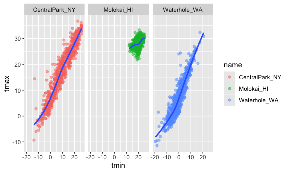

In the following code, `x` was set to `date` and y to `tmax`. The
scatterplot will show the max temperatures for the months recorded for
each location (categorized data).

- `aes(size = prcp)`: size of the points in plot will be mapped to the
  values of `prcp` variable. If `prcp` value is large, the point will be
  bigger, vice versa.

``` r
ggplot(weather_df, aes(x = date, y = tmax, color = name)) + 
  geom_point(aes(size = prcp), alpha = .5) +
  geom_smooth(se = FALSE) + 
  facet_grid(. ~ name)
```

    ## `geom_smooth()` using method = 'loess' and formula = 'y ~ x'

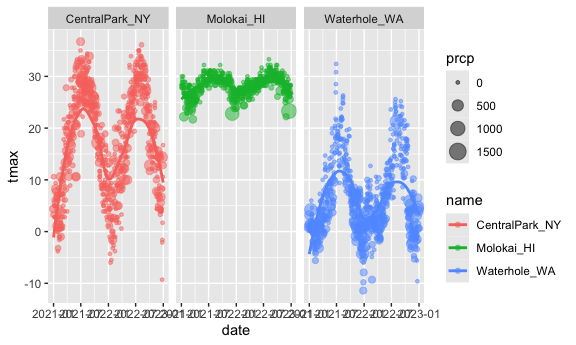

#### Learning Assessment

- `method = "lm"` to `geom_smooth` creates a linear regression line.

``` r
weather_df |> 
  filter(name == "CentralPark_NY") |>
  mutate(tmax_fahr = tmax * 1.8 + 32, 
         tmin_fahr = tmin * 1.8 + 32) |>
  ggplot(aes(x = tmin_fahr, y = tmax_fahr)) + 
  geom_point(alpha = 0.5) +
  geom_smooth(method = "lm", se = FALSE)
```

    ## `geom_smooth()` using formula = 'y ~ x'

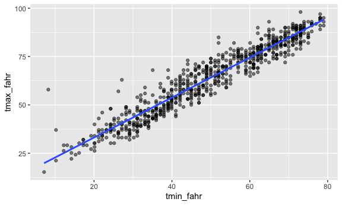

## Odds and Ends

- `geom_hex()` divides the plot area into regular hexagons, counts the
  number of observations within each, and maps these counts to the
  hexagon’s fill color.
- `geom_bin2d()` creates a 2D histogram by dividing the plot area into
  rectangles (bins), counting the number of observations in each, and
  mapping these counts to the rectangle’s fill color.
- `geom_density2d()` adds contours representing density of observations
  in a 2D plane, effectively visualizing the distribution of data points

``` r
ggplot(weather_df, aes(x = tmax, y = tmin)) + 
  geom_hex()
```

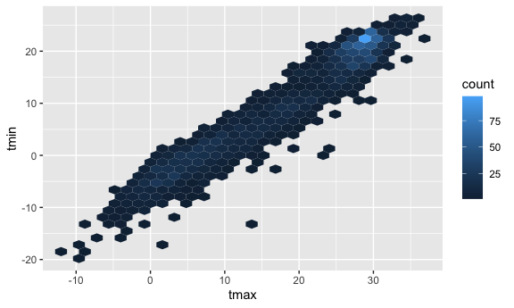

#### Learning Assessment

``` r
ggplot(weather_df) + geom_point(aes(x = tmax, y = tmin), color = "blue")
```

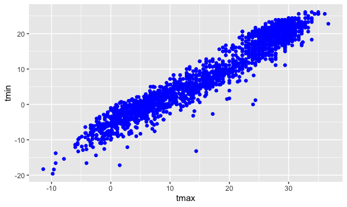

``` r
ggplot(weather_df) + geom_point(aes(x = tmax, y = tmin, color = "blue"))
```

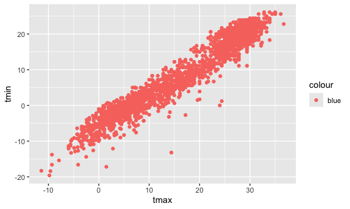

- In the first attempt, all points will be colored blue, and the color
  is applied as a fixed aesthetic for all points in the plot.
- In the second attempt, interprets “blue” as a categorical variable
  rather than a color. Since “blue” is treated as a data value, the plot
  will assign it to a legend, but it won’t actually color the points
  blue. Instead, it’s expecting “blue” to be a variable in the dataset.

## Univariate Plots

### geom_histogram()

- `fill = name`: `fill` aesthetic maps to the name variable in the
  dataset. Different categories of name will be assigned different fill
  colors in the histogram bars.
- `position = "dodge"`: instead of stacked bars, creates separate bars
  for each category of name next to each other for easier comparison.
- `binwidth = 2`: This specifies the width of each bin

``` r
ggplot(weather_df, aes(x = tmax, fill = name)) + 
  geom_histogram(position = "dodge", binwidth = 2)
```

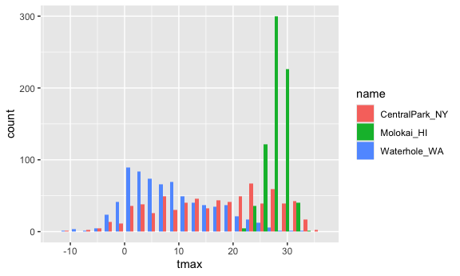

### geom_density()

- `adjust = .5`: adjusts the bandwidth (the smoothness) of density
  estimate. A smaller bandwidth (less than 1) means the density plot
  will be more detailed and less smooth (more sensitive to small
  variations in the data).
- `color = "blue"`: specifies that the outline of the density plot will
  be blue, but the fill colors will still correspond to the name
  variable.
- `geom_rug()`: This adds small tick marks at the bottom of the plot,
  representing the individual data points along the x-axis.

``` r
ggplot(weather_df, aes(x = tmax, fill = name)) + 
  geom_density(alpha = .4, adjust = .5, color = "blue") +
  geom_rug()
```

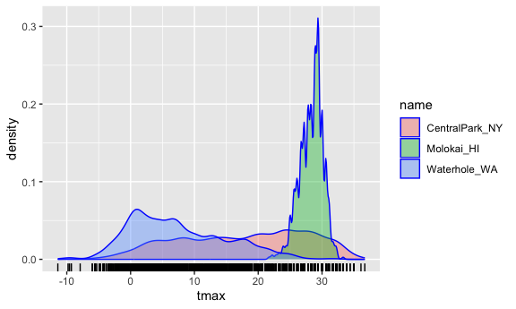

### geom_boxplot()

``` r
ggplot(weather_df, aes(x = name, y = tmax)) + 
  geom_boxplot()
```

    ## Warning: Removed 17 rows containing non-finite outside the scale range
    ## (`stat_boxplot()`).

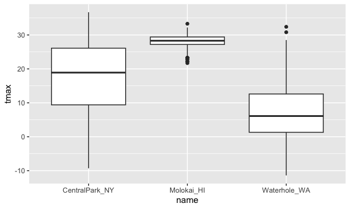

### geom_violin()

- `stat_summary()`: This function allows to compute and display summary
  statistics on the plot.
  - `fun = "median"`: calculates the median of the tmax values for each
    category in name.
  - `color = "blue"`: median will be represented as a blue line.

``` r
ggplot(weather_df, aes(x = name, y = tmax)) + 
  geom_violin(aes(fill = name), alpha = .5) + 
  stat_summary(fun = "median", color = "blue")
```

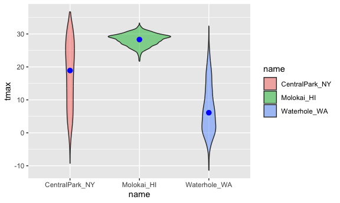

### geom_density_ridges()

- `scale = .85`: controls the vertical scaling of the density ridges.
  - By default, the density curves are scaled so that they are spread
    out evenly.

  - \<1: ridges are compressed vertically, which reduces the overlap
    between them.

  - 1: would increase the height of the ridges and cause more overlap.

``` r
ggplot(weather_df, aes(x = tmax, y = name)) + 
  geom_density_ridges(scale = .85)
```

    ## Picking joint bandwidth of 1.54

    ## Warning: Removed 17 rows containing non-finite outside the scale range
    ## (`stat_density_ridges()`).

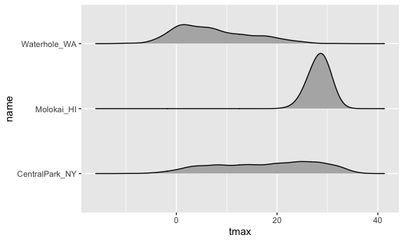

#### Learning Assessment

``` r
ggplot(weather_df, aes(x = prcp, fill = name)) +
  geom_histogram(binwidth = 50) +
  xlim(0, 500) +
  ylim(0, 150)
```

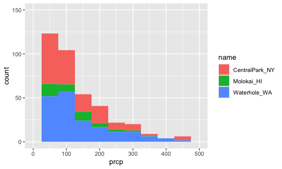

``` r
ggplot(weather_df, aes(x = name, y = prcp)) + 
  geom_boxplot()
```

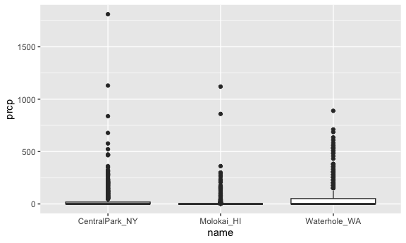

``` r
ggplot(weather_df, aes(x = prcp, fill = name)) + 
  geom_density(alpha = .4, adjust = .5, color = "blue")
```

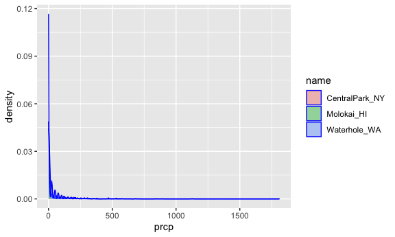

``` r
ggplot(weather_df, aes(x = name, y = prcp)) + 
  geom_violin(aes(fill = name), alpha = .5) + 
  stat_summary(fun = "median", color = "blue")
```

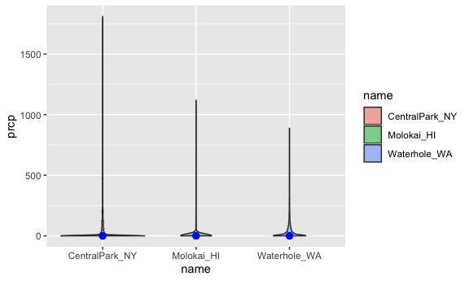

``` r
ggplot(weather_df, aes(x = prcp, y = name)) + 
  geom_density_ridges(scale = .85)
```

    ## Picking joint bandwidth of 9.22

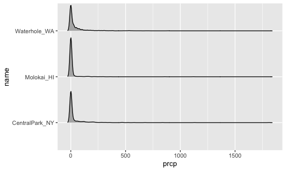

## Saving and Embedding Plots

Use `ggsave()` by explicitly creating the figure and exporting. It will
guess the file type you prefer and has options for specifying features
of the plot.

``` r
ggp_weather = 
  ggplot(weather_df, aes(x = tmin, y = tmax)) + 
  geom_point(aes(color = name), alpha = .5) 

ggsave("ggp_weather.pdf", ggp_weather, width = 8, height = 5)
```

Embedding plots to R Markdown:

- `fig.width` sets the width of the figure in inches
- `fig.asp` stands for aspect ratio. It defines the height of the figure
  relative to its width (e.g fig.asp = 0.6, height will be 60% of
  width).
- `out.width` controls the display size of the figure in the output (e.g
  90% of the width of the output container).
- `out.height` specifies the height of the output for figures when
  rendering document.

``` r
knitr::opts_chunk$set(
  fig.width = 6,
  fig.asp = .6,
  out.width = "90%"
)
```
